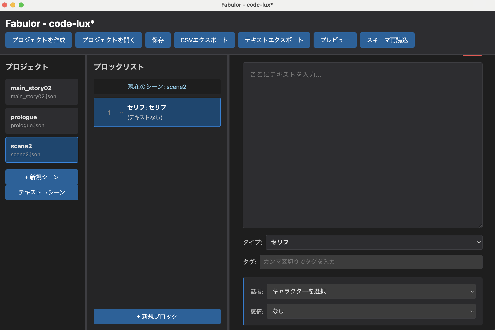

# Fabulor - シナリオライティングツール



## 📖 概要

**Fabulor** は、ビジュアルノベルへの組み込みを前提としたシナリオを執筆することに特化したアプリです。

## ✨ 特徴

### 🔧 YAMLによるコマンド・列挙体定義

- **柔軟な定義**: YAMLによって、ノベルスクリプトエンジンのコマンド名と引数を定義できます（FabulorではSchemaと呼んでいます）
- **Unity統合**: Unity-Integrationツールによって、YAML定義からC#スクリプトとデータのインポーターを生成可能

### 📝 コマンド単位でのライティング

- 一般的なドキュメントツールによるシナリオライティングでは、ノベルスクリプトとしてゲームに組み込むために一手間かかります。 
- また、シナリオ側で部分的な変更が入った場合などに、変更の追従が困難です。

- Fabulorでは、Fabulor自体がノベルエンジンのコマンドの構造を理解しているので、コマンド単位でデータを入力することが可能であり、一切の手間なくゲームに組み込み可能な形式にエクスポート可能です。

### 👀 プレビュー機能

以下の用途に対応したプレビュー機能をサポート：
- **小説形式プレビュー**: 通しで小説を確認できる
- **台本形式プレビュー**: 話者名付きセリフ表示で、声優に発注する場合などに便利

### 📤 標準規格エクスポート

- CSV形式とJSON形式のエクスポートに対応しています。

## 🚀 インストール方法

### 📋 前提条件
- **Node.js** (v16以上)
- **npm** または **yarn**

### 1 リポジトリのクローン
```bash
git clone https://github.com/Riyaaaaa/fabulor.git
cd fabulor
```

### 2 依存関係のインストール
```bash
npm install
```

### 3 アプリケーションの起動
```bash
npm start
```

## 📁 プロジェクト構造

```
your-project/
├── MyProject.fbl                 # プロジェクトファイル
├── MyProject_schema.yaml         # ブロックタイプ定義
├── MyProject_scenes/             # シーンファイル格納フォルダ
│   ├── scene_001.json
│   ├── scene_002.json
│   └── ...
└── output/                       # CSVエクスポート先
    ├── scene_1.csv
    ├── scene_2.csv
    └── ...
```

## 🛠️ 技術仕様

| 項目 | 詳細 |
|-----|-----|
| **フレームワーク** | Electron |
| **言語** | JavaScript (ES6 modules) |
| **データ形式** | JSON (プロジェクト・シーン), YAML (設定) |

---

**Fabulor** - Efficient Scenario Writing Tool for Creators
